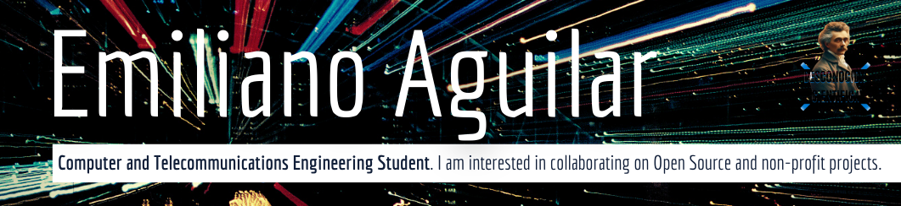

# Hi there, I'm Emiliano Aguilar 👋

  

---

## 🧑‍💻 About Me

- 🎓 Estudiante de **Ingeniería en Sistemas Computacionales y Telecomunicaciones** @ Iberoamericana CDMX
- 🔭 Experiencia en investigación con **ROOT/CERN** — análisis de masa invariante de muones
- 📡 Comunidad de divulgación científica con **+300K seguidores**
- 🚀 Fundador de **[LOVELACE](https://github.com/Fastreaa)** — agencia digital
- 🤝 Interesado en colaborar en proyectos **Open Source y sin fines de lucro**

---

## 🔥 Currently

- 🧠 Aplicando conceptos del área de redes, sistemas embebidos y desarrollo web
- 🤖 Explorando proyectos con **Raspberry Pi Pico W**, redes neuronales y APIs de IA
- 🌐 Construyendo productos digitales con React, Tailwind y arquitecturas modernas

---

## 🛠️ Languages & Tools

### 💬 Languages

  

### 🗄️ Databases

  

### ⚙️ Frameworks & Tools

  

  
  &nbsp;
  
  &nbsp;
  
  &nbsp;
  

---

## 📊 GitHub Stats

  
  &nbsp;
  

  

---

## 🌐 Connect with me

  
  &nbsp;
  

---

  

